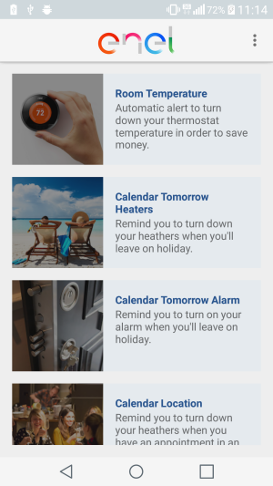
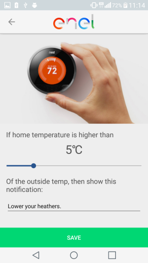

## Fixed bugs (compared to demo app)

* fixed multiple gcalendar accounts
* added "delete data"
* added settings
* splitted CalendarTomorrowRule
* fixed Room/weather temp rule
* added a connectivity monitor, that will prevent user to change any rule status while connection is off.  
Note that user can still change whatever preference he wishes.

**Note about connectivity monitor**  
Every time user connectivity became up, a call is made to tell gae server that user is online.  
As android throws lots of "Connectivity changed" signals while eg connecting to a Wifi network, your server can be spammed from "/user/register" calls. They're very light calls, so it really doesn't matter much.  
But for better scalability, probably this issue should be addressed.  
Another related issue is that these "connectivity changed" signals depends on android version / probably smartphone hardware too, so they are very inconsistent between different phones.  
Ie: my phone can throw only one signal, while yours can send 4-5 signals each time a new connection is established.  

## Known bugs
**Currently there are no known bugs.**

## Where can I download devel version?
[Here.](https://drive.google.com/a/atooma.com/file/d/0B6EvpPdx6S6sNG5xaXJIUEFWR28/view?usp=sharing)
This has no more been updated since we started a closed beta on google play store. So it has some bugs/less feature.

## Development info
We worked hard to fix some small bugs raised since we published the app on play store in private beta. Moreover, we worked towards cleaning up and improve code sources.  
In latest days we added 2 new rules too:  
the first will notify user to turn off air conditioning whenever a rainy day with temperature that drops below 25c happens.  
The second one will tell user to pull down the sun blinds whenever a very warm sunny day happens.  
Again, CEP and CB helped us to reach our goals quite fast thanks to their versatility.

## Some updated screenshots:

