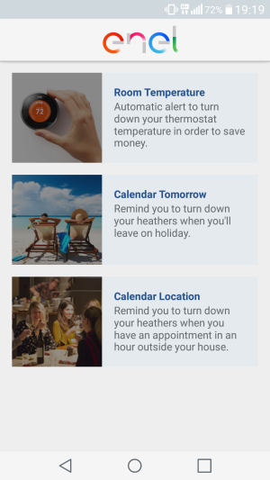

## What is fiware-android?

Fiware-android is an android app focused on automation, user-friendliness and somewhat "environmental sustainability".  
It is built by Atooma as a proof of concept about what can be achieved with fiware components.  
Its main challenge was to work with two fiware components: Orion Context Broker and Proton Complex Events Processing Technology. More on this later on.

## Which usecases does fiware-android suit?  

* External temperature (weather) and home internal sensor temperature differ by some (user defined) degrees: user will be notified on its android phone to lower its heaters.
Obviously inside the app, internal sensor is faked through a small python script.
* Google Calendar has an "holiday" (we'll check inside both description and event title for "holiday" word) event for tomorrow, then we'll push two notifications to user:  
one to remember him to switch off the heaters, the other to remember him to switch on the alarm.
* Google Calendar has an event with external location an hour from now, and user is at home: the app will notify user to lower the heaters.

## Where can I get it?

**This was our demo app, and it is not working anymore.**  
Please go to [Devel](Devel#where-can-i-download-devel-version) to grab latest apk.  

App screenshot:  
  
note that options are enabled/disabled by sliding. 
